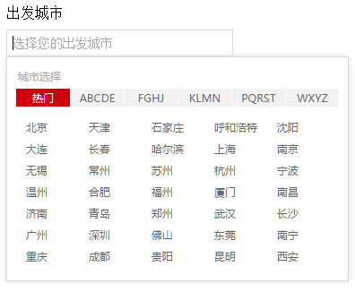
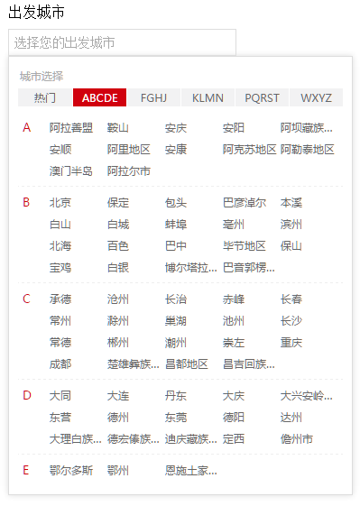

# vue-city-picker

vue城市选择组件（按城市首字母排序）


## 更新日志

### @1.0.0
- 我出生了


## demo

示例（vue@1.0+） [点我](http://dai-siki.github.io/vue-city-picker/example/demo.html).


## 截图





## 依赖

基于 vue.js@1.0+ 版本，模块使用es6编写（需babel转译），css使用scss编译（需scss-loader转译）。

## 城市列表数据源
[china-city-data](https://github.com/dai-siki/china-city-data).

当然你可以使用自己的数据，格式与此相符即可，该组件最终需要的是一个名为“CITY_PICKER_LIST”的全局变量。


## 安装

#### npm

```shell
$ npm install vue-city-picker china-city-data
```

## 使用

参考示例，城市列表需要按指定的格式，并声明全局变量。

#### 相关参数

| 名称              | 类型               | 默认             | 说明                                         |
| ----------------- | ----------------- | ---------------- | --------------------------------------------- |
| value             | String            | ""               | 要双向绑定的城市Id                |
| field             | String            | ""               | 会给input标签添加name及id属性                   |
| placeholder       | String            | ""               | 你懂的                                     |
| no-hot       | Boolean            | false               | 没有‘热门城市’                                     |
| city-list       | Object            | window.CITY_PICKER_LIST               | 可以自定义城市列表                                     |


#### 示例(vue@1.0+)

```html

<div id="app">
	<label for="city">出发城市</label>
	<city-picker field="city" placeholder="选择您的出发城市" :value.sync="cityId"></city-picker>
</div>

<script>
import 'babel-polyfill'; //因为使用了es6的一些方法，需要babel垫片，如果你项目中已有相关兼容性方案，可忽略
import cityList from 'china-city-data';
import Vue from 'vue';
import myCityPicker from 'vue-city-picker';

//注册一个城市列表全局变量（考虑到cityList会比较大，如项目中多次使用，单独为一个js文件比较好）
window.CITY_PICKER_LIST = cityList;

new Vue({
	el: '#app',
	data: {
		cityId: ''
	},
	components: {
		'city-picker': myCityPicker
	}
});

</script>

```

#### 附：根据数据库生成指定格式cityList的json文件（php参考示例，数据库表至少有id、name、show(首字母)、parent_id(父级id)）

```php
<?php

$db_conf = [
    'host' => '127.0.0.1',
    'username' => 'root',
    'password' => '123456',
    'dbname' => 'city',
    'charset' => 'utf8'
];

//查询数据库得到数据
$db = mysqli_connect($db_conf['host'], $db_conf['username'], $db_conf['password'], $db_conf['dbname']);
if (!$db) {
	die('---------- mysql connect false ---------');
}
mysqli_set_charset($db, "utf8");
$result = mysqli_query($db, 'SELECT * FROM city');

//城市picker数据
$cityPickerJsonData = [
	'hot' => []
];
// 热门城市列表
$hotCity = [
	"北京",
	"上海",
	"广州",
	"深圳",
	"成都",
	"重庆",
	"杭州",
	"南京",
	"沈阳",
	"苏州",
	"天津",
	"武汉",
	"西安",
	"长沙",
	"大连",
	"济南",
	"宁波",
	"青岛",
	"无锡",
	"厦门",
	"郑州",
	"长春",
	"常州",
	"哈尔滨",
	"福州",
	"昆明",
	"合肥",
	"东莞",
	"石家庄",
	"呼和浩特",
	"南昌",
	"温州",
	"佛山",
	"贵阳",
	"南宁"
];
while ($row = mysqli_fetch_array($result)) {
	// 城市picker数据处理
	if($row['parent_id'] >= 1 && $row['parent_id'] <= 34){ //父级为省
		$initial = $row['show'];
		if(!isset($cityPickerJsonData[$initial])){
			$cityPickerJsonData[$initial] = [];
		}
		array_push($cityPickerJsonData[$initial], array(
			'id' => $row['id'],
			'name' => $row['name']
		));
		if(in_array($row['name'], $hotCity)){
			array_push($cityPickerJsonData['hot'], [
				'id' => $row['id'],
				'name' => $row['name']
			]);
		}
	}
}
mysqli_close($db);

//编译json写入文件
ksort($cityPickerJsonData);
$cityPickerJson = json_encode($cityPickerJsonData);
$cityPickerJsonFile = fopen('./city-picker-list.json', 'w');
fwrite($cityPickerJsonFile, $cityPickerJson);
fclose($cityPickerJsonFile);


echo '--------- success ---------';
?>

```
